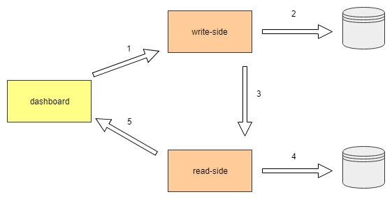

# CQRS Lite nodejs

This project wants to be the porting on nodejs, of CQRSLite framework written in C# at the following link:

    https://github.com/gautema/CQRSlite

This work is a work in progress and definitely improvable.
There are many framework ready to use, but I wanted to study in a deep way the CQRS and Event Sourcing patterns. I think that the most useful way to achieve this is study, to write code and to try personally and starting from a lite framework is a good approach in my opinion.

## System Explained

The system is composed of 5 projects:

- cqrs-lite: the core framework
- cqrs-lite-common: the common layer, shared between write-side and read-side
- common-utils: common libraries [NOT USED NOW]
- dashboard: the front end application for inserting and showing data
- write-side: the service the handles the incoming commands from the front end
- read-side: the service the handles the outcoming queries to the front end

### Architecture

The following picture shows the flow of the data through main components

## Run the System

In order to run the system you need to follow these steps:

- download or clone the repository
- go under the folder write-side and type:

        npm install
        npm run link [link is a task that run: npm link ../cqrs-lite && npm link ../cqrs-lite-common]
        npm start

    In the package.json there are defined some tasks, also usable during debug in VS Code (see .VSCode folder).

- go under the folder read-side and type:

        npm install
        npm run link [link is a task that run: npm link ../cqrs-lite && npm link ../cqrs-lite-common]
        npm start

    In the package.json there are defined some tasks, also usable during debug in VS Code (see .VSCode folder).

- go under the folder dashboard and type:

        npm install
        npm start

## References

## DDD

- https://github.com/gautema/CQRSlite
- https://exceptionnotfound.net/real-world-cqrs-es-with-asp-net-and-redis-part-1-overview/

### Command, CommandHandler and CommandBus

- https://culttt.com/2014/11/10/creating-using-command-bus/

- https://github.com/erickjth/simple-command-bus

- http://cqrs.nu/Faq/command-handlers

- https://enterprisecraftsmanship.com/2019/02/20/validate-commands-cqrs/

### CQRS

- https://watermill.io/docs/cqrs/

### Event Sourcing

- https://blog.risingstack.com/event-sourcing-with-examples-node-js-at-scale/

- https://xebia.com/blog/cqrs-designing-the-event-store/

- https://github.com/speedment/speedment/wiki/Tutorial:-Create-an-Event-Sourced-System

- https://blog.sebastian-daschner.com/entries/event_sourcing_cqrs_video_course

### Miscellaneous

- https://rfvallina.com/blog/2015/11/12/share-private-node-dot-js-modules-across-applications-locally.html

- https://www.twilio.com/blog/2017/06/writing-a-node-module-in-typescript.html