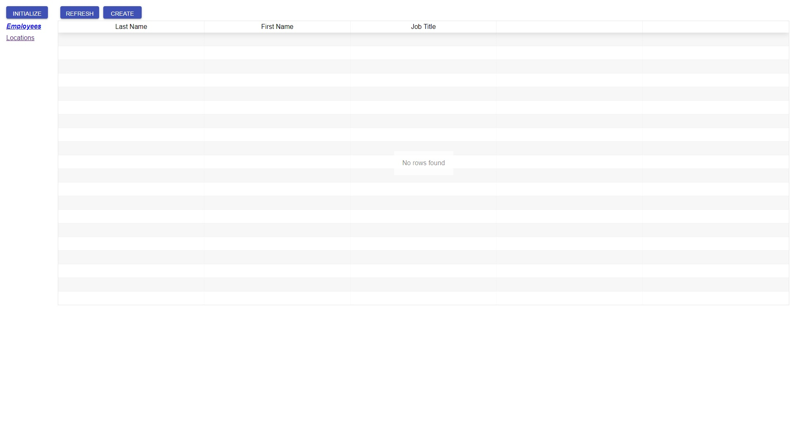
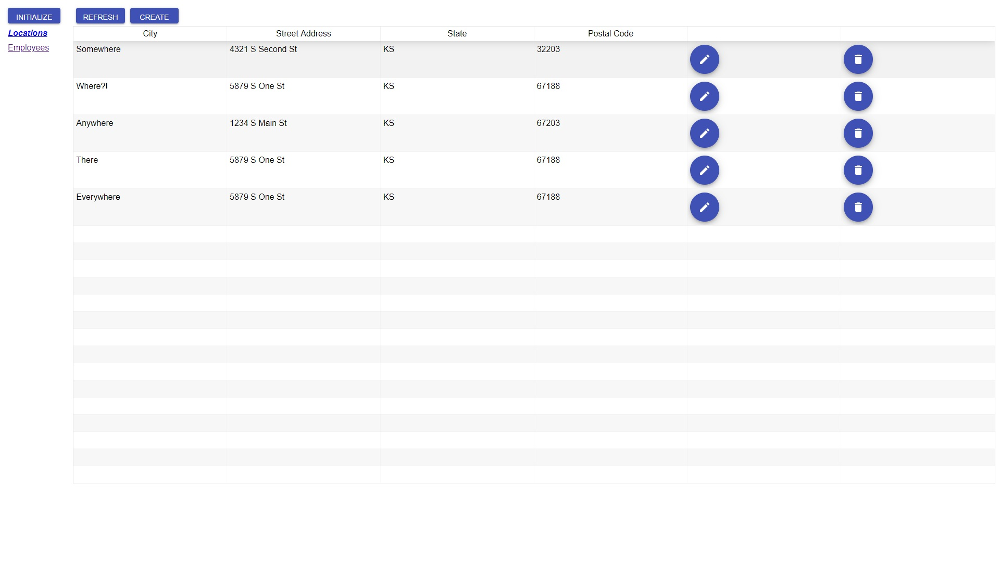
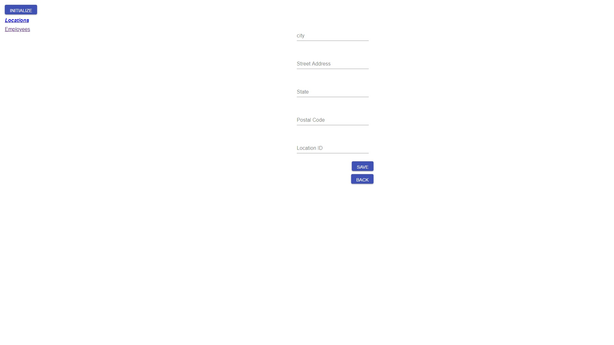
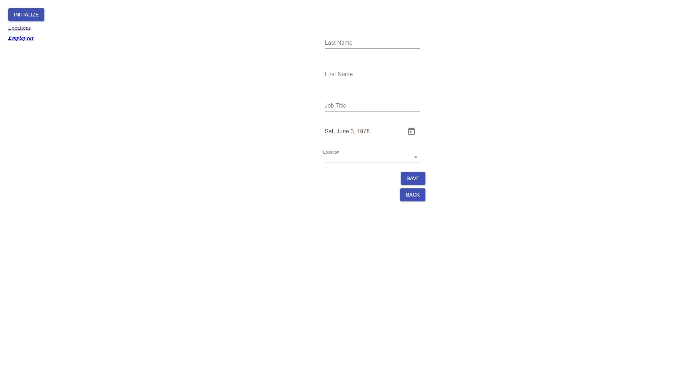

# CQRS Lite nodejs

This project wants to be the porting on nodejs, of CQRSLite framework written in C# at the following link:

    https://github.com/gautema/CQRSlite

This work is a work in progress and definitely improvable.
There are many framework ready to use, but I wanted to study in a deep way the CQRS and Event Sourcing patterns. I think that the most useful way to achieve this is to study, to write code and to try personally. Starting from a lite framework is a good approach in my opinion.

## System Explained

The system is composed of 6 projects:

- cqrs-lite: the core framework
- cqrs-lite-common: the common layer, shared between write-side and read-side
- common-utils: common libraries [NOT USED NOW]
- dashboard: the front end application for inserting and showing data
- write-side: the service the handles the incoming commands from the front end
- read-side: the service the handles the outcoming queries to the front end

### Architecture

The following picture shows the flow of the data through main components

## Run the System

In order to run the system you need to follow these steps:

- install and run redis
- download or clone the repository
- go under the folder write-side and type:

        npm install
        npm run link [link is a task that run: npm link ../cqrs-lite && npm link ../cqrs-lite-common]
        npm start

    In the package.json there are defined some tasks, also usable during debug in VS Code (see .VSCode folder). All things are ready, so if you run the debug all should work.

- go under the folder read-side and type:

        npm install
        npm run link [link is a task that run: npm link ../cqrs-lite && npm link ../cqrs-lite-common]
        npm start

    In the package.json there are defined some tasks, also usable during debug in VS Code (see .VSCode folder). All things are ready, so if you run the debug all should work.

- go under the folder dashboard and type:

        npm install
        npm start

### Using the System

Open the web application at the url:

    http://localhost:3000/employees

The program appears in this way:

The same grid with different data will be shown at the following url:

    http://localhost:3000/locations

There will be an error from server without initializing the system after every call to get a list.

So it's better to initialize the system with fake data created on the server and pushed on redis.
After clicking the Initialize button you can refresh the current list with the Refresh button.

For the locations list you'll have:

If you want to add a new location, press the Create button above the list:

Click Save button.
NOTE: the Location ID must be unique (check on the location list)

The same for adding a new Employee:

If you want to delete ALL (pay attention with this command) data on redis, you have to run the following command:

    redis-cli FLUSHALL

Modify and Delete actions are not implemented.

## Run with Kubernetes (minikube) - FROM HERE WORK IN PROGRESS

Download minikube and kubectl, for using minikube and kubectl command lines.

Type for starting minikube (from C drive, otherwise minikube is not able to get the iso once downloded):

        minikube start

The default memory is 2048, not enough, so start minikube with more memory:

        minikube start --memory 4096

 or change the config.jon under (it's really important to do that otherwise strange behaviours come, for example apiServer stopped):

        C:\Users\<<user>>\.minikube\machines\minikube

by command line:

         minikube config set memory 4096

minikube delete and then minikube start need.
in this way the file at:

        C:\Users\<<user>>\.minikube\config)

will change.

Using the minikube daemon for building images:

        minikube docker-env

if the following message appears:

        $Env:DOCKER_TLS_VERIFY = "1"
        $Env:DOCKER_HOST = "tcp://<<minikube ip>>:<<port>>"
        $Env:DOCKER_CERT_PATH = "<<certs path>>"
        $Env:DOCKER_API_VERSION = "1.35"
        # Run this command to configure your shell:
        # & minikube docker-env | Invoke-Expression

You have to type:

        minikube docker-env | Invoke-Expression

Now, using docker commands, you'll use minikube daemon.

First of all, you have to build all bundles with the following commands:

- under the dashboard folder:

        npm run build

- under the write-side folder:

        npm run bundle

- under the read-side folder:

        npm run bundle

Under dashboard folder create the image for the dashboard project:

        docker build -t dashboard:v1 .

define the deployment:

        kubectl run dashboard --image=dashboard:v1 --port=80

expose the application through a service:

        kubectl expose deployment dashboard --type=NodePort

make the service accessible:

        minikube service dashboard --url

check all services installed:

        kubectl get service

check the minikube ip:

        minikube ip

to access from external to your application you have to use:

        <<minikube ip>>:<<service port>>

In the same way it will be possible to run the write-side and the read-side services, starting from the following commands to build images:

        docker build -t write-side:v1 .
        docker build -t read-side:v1 .

To install Redis, follow the instructions at the url:

https://redislabs.com/blog/local-kubernetes-development-using-minikube-redis-enterprise/

### Using yaml

First of all, build images for all actors:

- dashboard
- write-side
- read-side

using the following commands, under each specific actor folder:

        docker build -t dashboard:v1 .
        docker build -t write-side:v1 .
        docker build -t read-side:v1 .

Under the folder k8s type:

        kubectl create -f a.pod.yaml
        kubectl create -f b.deployment.yaml
        kubectl create -f c.service.yaml

Or you prefer to do all together:

        kubectl create -f d.all-together.yaml

For running Redis on minikube, follow these steps, under the k8s folder:

- type:

                kubectl apply -f redis.yaml

## References

## DDD

- https://github.com/gautema/CQRSlite
- https://exceptionnotfound.net/real-world-cqrs-es-with-asp-net-and-redis-part-1-overview/

### Command, CommandHandler and CommandBus

- https://culttt.com/2014/11/10/creating-using-command-bus/
- https://github.com/erickjth/simple-command-bus
- http://cqrs.nu/Faq/command-handlers
- https://enterprisecraftsmanship.com/2019/02/20/validate-commands-cqrs/

### CQRS

- https://watermill.io/docs/cqrs/

### Event Sourcing

- https://blog.risingstack.com/event-sourcing-with-examples-node-js-at-scale/
- https://xebia.com/blog/cqrs-designing-the-event-store/
- https://github.com/speedment/speedment/wiki/Tutorial:-Create-an-Event-Sourced-System
- https://blog.sebastian-daschner.com/entries/event_sourcing_cqrs_video_course

### Build for containers

- https://medium.com/@fidelvti/minikube-first-steps-with-kubernetes-8d433fa7c958
- https://medium.com/skillshare-team/from-docker-compose-to-minikube-d94cbe97acda
- https://stackoverflow.com/questions/41495658/use-custom-build-output-folder-when-using-create-react-app
- https://github.com/facebook/create-react-app/issues/982#issuecomment-273032553
- https://coderjourney.com/define-kubernetes-objects-using-yaml/
- https://www.mirantis.com/blog/introduction-to-yaml-creating-a-kubernetes-deployment/
- https://medium.com/@jiamin_ning/build-your-first-kubernetes-service-with-replicaset-7c37d9be689c
- https://stackoverflow.com/questions/47369351/kubectl-apply-vs-kubectl-create
- https://redislabs.com/blog/local-kubernetes-development-using-minikube-redis-enterprise/
- https://darkowlzz.github.io/post/minikube-config/

### Miscellaneous

- https://rfvallina.com/blog/2015/11/12/share-private-node-dot-js-modules-across-applications-locally.html
- https://www.twilio.com/blog/2017/06/writing-a-node-module-in-typescript.html